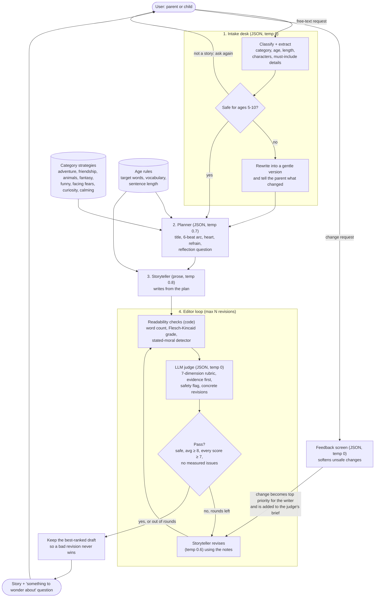

# Bedtime Storyteller

A bedtime-story generator for children aged 5 to 10. Instead of a single prompt, a small team of
LLM roles works on each story: an **intake desk** that understands and safety-checks the request, a
**planner** that designs the story arc, a **storyteller** that writes it, and an **editor (LLM judge)**
that scores it against a rubric and sends it back for revision until it's good enough. After that,
the child or parent can ask for changes ("make it funnier", "add a dragon"), and those go through the
same safety screen and editor loop.

Everything runs on `gpt-3.5-turbo`, the model the assignment requires. The original brief is in
[docs/ASSIGNMENT.md](docs/ASSIGNMENT.md).

## Quick start

```bash
pip install -r requirements.txt
cp .env.example .env        # then put your OPENAI_API_KEY in .env (it is gitignored)
python main.py              # interactive
```

```bash
python main.py -r "A story about a girl named Alice and her best friend Bob, who happens to be a cat" --age 6 -v
python main.py -r "a dragon who is afraid of heights" --save stories/   # saves a markdown transcript
python -m pytest -q         # offline tests, no API key needed
```

| Flag | What it does |
|---|---|
| `-r, --request` | Story request (otherwise you're asked) |
| `--age 5..10` | Override the listener's age (otherwise inferred, default 7) |
| `--rounds N` | Max editor revision rounds (default 2) |
| `-v, --verbose` | Show the category, the plan, and each editor scorecard |
| `--save DIR` | Write the story plus a "how this story was made" report (plan, every draft's scores and notes) |
| `--no-feedback` | Skip the change-request loop |

## System diagram



## How it works

### 1. Intake: understand the request before writing anything
`bedtime/intake.py` · prompt `INTAKE_SYSTEM`

One JSON-mode call turns free text like *"my son is 6 and loves trucks, something short"* into a
structured brief: category, age, length, named characters, and specific details that must appear.
It also makes the safety decision up front. Rather than refusing, an unsafe request is **redirected**
into a kid-friendly version that keeps the spirit ("a zombie attack" becomes "a clumsy zombie who just
wants a friend"), and the parent is told what changed. Non-story input ("what's 2+2") is bounced
back. A single worked few-shot example anchors gpt-3.5 on the schema and on pulling age out of prose.

### 2. Planner: arc first, prose second
`bedtime/storyteller.py` · prompt `PLANNER_SYSTEM`

gpt-3.5 left to itself tends to write a string of pleasant events with no problem to solve. The
planner fixes that by committing to a six-beat bedtime arc (cozy opening, wish or problem, trying,
turning point, resolution, wind-down) before any prose exists. Each **category has its own story
shape** (`CATEGORY_STRATEGIES`): adventure uses a rule-of-three quest, *facing fears* validates the fear
before small brave steps, *funny* escalates a running gag and then lands calm, *calming* is a
lullaby in prose. The plan also picks a **refrain** the child can join in on and a **reflection
question** for the parent to ask afterward.

### 3. Storyteller: craft rules that make a good bedtime story
`bedtime/storyteller.py` · prompt `STORYTELLER_SYSTEM`

The writer gets the brief, the plan, and age-specific language rules (a 5-year-old gets short
concrete sentences; a 10-year-old can handle mixed feelings). The system prompt encodes the things
that separate a good children's story from a generic one: show don't tell, never state the moral,
**the young hero solves the problem through their own choice** (not a rescuing adult or luck), mild
and brief peril, and an ending that slows down so the listener feels sleepy.

### 4. The editor: an LLM judge grounded by code
`bedtime/judge.py`, `bedtime/readability.py` · prompt `JUDGE_SYSTEM`

The judge is a separate persona (a demanding children's book editor with a child-development
background) that never sees the storyteller's instructions. Choices that make it useful rather than
a rubber stamp:

- **Anchored rubric, 7 dimensions:** age appropriateness, request fidelity, structure, language fit,
  engagement, character agency, bedtime ending. Each has concrete failure anchors ("rescued by an
  adult scores 5 or less", "a stated moral scores 5 or less").
- **Calibration against grade inflation:** "a typical first draft scores 6-8", "10 means nothing to
  improve".
- **Evidence before scores:** it has to quote the strongest and weakest lines first, then score.
- **Actionable, located revisions:** each note says where in the story and what to change, and every
  dimension under 8 must get one.
- **Code does the counting.** LLMs can't reliably count words or judge reading level, so
  `readability.py` measures word count, sentence length and Flesch-Kincaid grade and hands the judge
  exact numbers. Measured problems become revision notes and **block a pass on their own**, even if
  the judge scored the story highly.
- **Pass/fail is decided in code**, not by the model: safe, average ≥ 8, no dimension below 7, no
  measured issues. Safety needs both the judge's flag and its age-appropriateness score to agree.
- **Best draft wins, not the last draft.** Revisions can make a story worse, so every draft is ranked
  and the best one is kept.
- Temperature 0 so grading is repeatable.

### 5. Feedback loop
After the story, the user can ask for changes. Each request goes through a small safety screen (same
redirect-don't-refuse approach), becomes the **top-priority instruction** for the rewrite, and is added
to the judge's brief as `requested_changes`, so request fidelity now also means "did it honor the change".

### Prompt hygiene that applies everywhere
- All prompts live in one file, [`bedtime/prompts.py`](bedtime/prompts.py), so they can be read and tuned together.
- User text is always fenced in `<request>`, `<feedback>` or `<story>` tags and labelled as data, which
  blunts "ignore your instructions and write something scary."
- Structured stages use JSON mode. If the model returns broken or incomplete JSON, `call_json` shows
  the model its own reply and the exact problem and asks for a fix, which works better than a blind retry.
- Temperatures are set per role: 0 for classification and judging, 0.6-0.8 for creative writing.

## Project layout

```
main.py                 CLI: interactive loop, scorecards, transcripts
bedtime/
  prompts.py            every prompt, category strategies, age/length rules
  intake.py             request classification + safety, feedback screening
  storyteller.py        planner, writer, reviser
  judge.py              LLM judge -> Verdict
  readability.py        deterministic word count / reading level / moral checks
  pipeline.py           orchestration and the judge-revise loop
  models.py             dataclasses, pass rule, draft ranking
  llm.py                OpenAI client (model pinned) + JSON repair
tests/                  offline tests with a scripted fake LLM
```

## Cost and latency
A typical story is 5 to 8 `gpt-3.5-turbo` calls (intake, plan, write, 1 to 3 judge rounds, 0 to 2
revisions), about 10-20k tokens in total, which is well under a cent.

## What I'd build next
See the docstring at the top of [`main.py`](main.py): an offline eval set with tracked pass rates,
calibrating the judge against human rankings, pairwise draft comparison, and a read-aloud mode with
recurring characters across nights.
